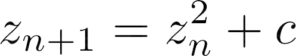

# The Mandelbrot Set

I'm Vinayak Vineeth, and this is my submission for the Mathematics Art integration project.  
The math concept used in the project is the topic of complex numbers

  

# Overview

The Mandelbrot Set is the set that contains all points that stay bounded to within an arbritary number called the "escape radius" when the formula  is applied multiple times, where c is any point on the plane.

  

# Try it out

Click [here](https://theicycoldpenguin.github.io/Mandelbrot-Set/) to try it out for yourself!

  

# How to Interact

-   To move around, simply click and drag your mouse around on the canvas
-   To zoom in or out,

    -   click on the "+" or "-" icons in the sidebar  
        or
    -   press the "+" and "-" keys on your keyboard

-   To change the resolution of the render, drag the "Max iterations" slider around.
    -   Do note that slower computers might have trouble handling higher resolutions.
    -   An interesting activity would be to move the slider all the way to the left, and slowly nudge it to the right.  
        This allows you to see how the image gets more detailed as the number of iterations increases.

  

# Gallery

  
  
  
  
  
  
  

  

# Interested in tinkering?

You'll need to know the TypeScript programming language. It is easy enough to pick up, especially if you already know JavaScript.  
You could alternatively try to directly edit the JavaScript file in the project.

To run the program from your own computer

-   Download the zip file
-   Unzip to a folder
-   Open the index.html file with any web browser

That's it!
